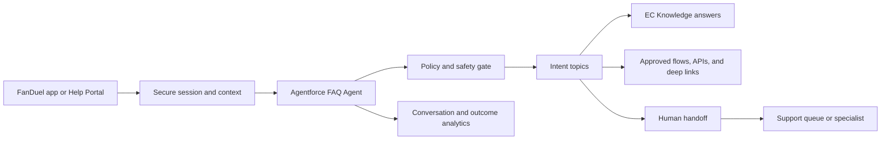

# FanDuel Agentforce FAQ Agent
## Build Definition and Readiness Assessment

**Audience:** Digital Care, Customer Experience, Salesforce Build, Knowledge, Compliance, Responsible Gaming, and Operations teams  
**Status:** Working definition for internal review  
**Source:** `faq-external-agent-spec.md`  
**Date:** September 2026

> This document translates the experience brief into a practical Agentforce build definition. It does not represent a final Salesforce architecture, delivery plan, cost model, or compliance approval. Items marked **[TBC]** require FanDuel or Salesforce validation.

## 1. Executive summary

FanDuel should introduce a customer-facing FAQ Agentforce experience on the EC Help Portal, with potential expansion to web and in-app support surfaces. The agent will answer common questions conversationally, guide customers through self-service procedures, provide trusted deep links into FanDuel flows, and route customers to human support when automation is inappropriate or unsuccessful.

The agent is not a replacement for EC Knowledge, human support, or the internal KAM Console Agentforce workstream. It is a conversational layer over approved knowledge and customer-support actions.

The initial release should focus on high-volume, high-confidence self-service intents:

- Login and password help
- Account verification
- 2FA setup and recovery
- Deposit and withdrawal guidance
- Location troubleshooting
- Common bonus, promo, bet, and transaction questions

Account lock, fraud, regulatory complaints, and Responsible Gaming situations should be treated as routing and safety experiences—not as standard containment opportunities.

The most important pre-build decisions are:

1. Whether the app and Help Portal use one agent or separate agents/subagents.
2. Which authenticated context can be securely passed at launch.
3. Whether the current chatbot platform can transfer transcript and context to a human.
4. Whether priority Knowledge articles are ready for Agentforce consumption.
5. What state-specific Responsible Gaming routing and suppression rules apply.

## 2. Target experience

### 2.1 Customer promise

The FAQ Agent should help a customer answer “What do I do next?” quickly and clearly. It should:

- Confirm the customer’s intent before giving a long answer.
- Prefer short, numbered steps over article-length explanations.
- Provide direct links to safe FanDuel actions where available.
- Remember context supplied by the originating app or session.
- Offer human help when the customer is stuck, at risk, or explicitly asks for it.
- Avoid commercial or promotional content when a safety or escalation policy applies.

### 2.2 Channels

| Channel | Initial position | Validation required |
|---|---|---|
| EC Help Portal | Primary deployment | Confirm with Digital Care |
| Web widget | Potential reuse of the same agent definition | Confirm channel and authentication model |
| In-app support entry point | Potential contextual launch from SBK, Casino, DFS, or Racing | Confirm same-agent versus separate-agent model |

The Help Portal deployment is the baseline assumption. In-app behavior remains dependent on the same-agent/subagent decision.

### 2.3 Out of scope

- Replacing EC Knowledge as the source of truth
- Replacing human support
- The internal KAM Console Agentforce workstream
- Unapproved account changes or financial decisions
- Legal or regulatory determinations
- Responsible Gaming retention, incentive, or promotional messaging
- A final platform, licensing, or hosting recommendation before validation

## 3. Scope and intent model

### 3.1 Resolution tiers

| Tier | Meaning | Agent behavior |
|---|---|---|
| Tier 1 — Full self-service | Customer can complete the task without a human | Answer, guide, provide action link, confirm resolution |
| Tier 2 — Guided + hand-off | Agent can explain or partially resolve the issue | Guide for one or two turns, then surface escalation if unresolved |
| Tier 3 — Necessary Transfer | Human support is required | Acknowledge, set expectations, route promptly; do not loop |

Tier 3 outcomes are intended outcomes and should not be treated as failed self-service.

### 3.2 Initial intent map

| Intent | Tier | Proposed topic family | Required behavior |
|---|---:|---|---|
| Password reset | 1 | Login and access | Numbered steps and secure reset deep link |
| 2FA setup / recovery | 1 | Login and access | Device-specific guidance and recovery path |
| Account verification | 1 | Verification | Decision tree by document or verification issue |
| Deposit status check | 1 | Payments | Status lookup or timeline explanation, if integration exists |
| Location check troubleshooting | 1 | Location | Reuse validated troubleshooting and deep-link pattern |
| Withdrawal status / timelines | 2 | Payments | Explain status and timing; escalate unexplained delay |
| Failed transaction | 2 | Payments | Explain likely cause; escalate when unresolved |
| Bet dispute | 2 | Bets and results | Explain settlement rules; route contested outcomes |
| Promo / bonus eligibility | 2 | Promotions | Explain approved terms; escalate flagged errors |
| How to contact support | 2 | Contact and support | Run a brief deflection checklist, then offer human support |
| Account locked / suspended | 3 | Account protection | Immediate human route and expectation-setting |
| Fraud / unauthorized access | 3 | Account protection | Immediate protected route; do not probe unnecessarily |
| Regulatory complaint | 3 | Complaints | Immediate route to designated contact |
| Responsible Gaming escalation | 3 | Responsible Gaming | Apply RG gate before normal intent resolution |

### 3.3 Recommended zero-state starters

1. I can’t log in to my account
2. How do I withdraw my winnings?
3. I need to verify my account
4. Query a bet or result
5. Bonus or promo question
6. Something else

These buttons start an intent-aware conversation; they are not article links.

## 4. Conceptual Agentforce architecture

This is a conceptual model only. The following require Salesforce and FanDuel validation:

- Agent and topic configuration
- Whether EC Knowledge is exposed directly or through a synchronized/indexed source
- Available APIs and Flow/Apex actions
- Authentication and account-status lookup
- Secure context transport
- Human queue routing and transcript transfer
- Reporting and analytics integration

### 4.1 Topic design principles

- Group topics around customer intent, not the existing product-category sitemap.
- Keep Tier 3 topics intentionally narrow and routing-oriented.
- Put Responsible Gaming policy enforcement before commercial or general intent resolution.
- Use actions only where the action is approved, authenticated, auditable, and safe to retry.
- Make fallback behavior explicit for every topic.

## 5. Conversation experience

### 5.1 Greeting variants

| Launch context | Example |
|---|---|
| From SBK, Casino, DFS, or Racing app | “Hi [Name], I can see you were in [Product]. What can I help with?” |
| Authenticated Help Portal | “Hi [Name], what can I help with today?” |
| Unauthenticated or organic visitor | “Hi, I’m the FanDuel Help Agent. What can I help with?” |

The agent should not claim to know a customer’s page or account state unless that context has been securely validated.

### 5.2 Conversation rules

1. Identify or confirm the customer’s intent.
2. Check for safety and immediate escalation conditions.
3. Provide the shortest useful answer or next step.
4. Use numbered steps and direct links for procedures.
5. Confirm whether the issue is resolved.
6. Offer escalation for unresolved or explicitly escalated cases.
7. Preserve context during handoff.

### 5.3 Example outcomes

**Password reset — Tier 1**

> Customer: I can’t log in.  
> Agent: I can help with that. Are you unable to remember your password, or are you seeing an error after entering it?  
> Customer: I forgot it.  
> Agent: Select **Reset password**, enter the email or phone number on your account, and follow the verification steps. [Reset password]  
> Agent: Were you able to start the reset?

**Withdrawal delay — Tier 2**

> Agent: I can explain the usual withdrawal timeline. If your withdrawal is outside that timeline or shows an error, I can connect you with a specialist. Do you want to check the status or speak with support?

**Account locked — Tier 3**

> Agent: I’m sorry you’re dealing with this. An account specialist needs to review a locked account, so I’ll route you to support now. Have your identification available in case verification is required.

**Fraud or unauthorized access — Tier 3**

> Agent: I’m going to connect you with the team that handles account security. Please do not share your password or one-time verification codes here.

**Responsible Gaming gate**

> Agent: I’m here to help with Responsible Gaming support. I can provide the available support resources and required contacts. I can’t assist with promotions, bonuses, or other play-related incentives in this session.

Final copy, routing, and state-specific resources require Compliance and Responsible Gaming approval.

## 6. Responsible Gaming controls

The Responsible Gaming gate is a hard, non-configurable policy requirement.

When an active RG flag is present—such as cooling off, self-exclusion, a limit threshold, or an active escalation—the agent must:

1. Acknowledge the customer warmly and without judgment.
2. Show only approved RG resources and state-mandated contacts.
3. Suppress bonuses, promotions, incentives, and retention language.
4. Route to the designated RG path where required.
5. Close the general FAQ resolution loop.

The preferred implementation pattern—pre-agent policy, hard-gated topic, or specialized subagent—requires Salesforce and Compliance validation. The outcome must be deterministic, testable, auditable, and applied before normal intent resolution.

## 7. Context-passing contract

| Parameter | Source | Agent use | Failure behavior |
|---|---|---|---|
| `product` | FanDuel app | Product-relevant starters and context | Use generic Help Portal experience |
| `user_id` | Authenticated session | Resolve identity and personalize | Do not infer identity from untrusted input |
| `account_status` | Validated account service | Surface known account issue or route | Ask the customer to authenticate or escalate |
| `last_page` | App navigation history | Confirm likely task | Treat as a suggestion, not a confirmed intent |

Sensitive identity and account information must not be trusted solely because it appears in a URL or client-controlled parameter. FanDuel and Salesforce must define secure session validation, authorization, retention, and logging rules.

Owners are needed for each app support entry point. Without those owners, the contract cannot be delivered or maintained.

## 8. Knowledge and content readiness

Agentforce answer quality depends on the quality and structure of the underlying content. Priority articles should be rewritten into:

- Numbered steps
- One action per step
- Explicit decision branches
- Inline deep links
- Short H2/H3 sections
- Product, device, and jurisdiction distinctions where relevant
- Clear “contact a specialist” instructions for necessary-transfer cases

### 8.1 Priority content families

1. Password and login
2. 2FA
3. Account verification
4. Withdrawal and deposit status
5. Location troubleshooting
6. Account locked and contact support
7. Responsible Gaming resources

### 8.2 Governance checklist

- Confirm EC Knowledge as the source of truth.
- Assign article owners and SME reviewers.
- Define review cadence and approval workflow.
- Record product and state applicability.
- Add deep links and test them on mobile.
- Monitor escalation and repeat-session signals by article.
- Trigger review after significant chat-rate or fallback spikes.

## 9. Human handoff and operating model

Immediate escalation is required for:

- Locked or suspended account
- Fraud, stolen account, or unauthorized access
- Active RG flag
- Three failed resolution attempts on the same intent
- Explicit request for a human agent
- Regulatory complaint or other designated necessary-transfer intent

The handoff experience should:

1. Acknowledge the issue without blame.
2. Avoid invented wait times or service commitments.
3. Pass conversation context and relevant validated metadata.
4. Tell the customer what documents or information may be needed.
5. Route to the correct queue or specialist.
6. Define behavior when live support is unavailable.

The current chatbot platform and its transcript-transfer capability are **[TBC]**. If context cannot be transferred, that is a technical prerequisite to resolve before promising a seamless experience.

## 10. Measurement and analytics

| Metric | Purpose |
|---|---|
| Containment rate | Sessions resolved without escalation, excluding designed Tier 3 transfers |
| Tier 1 resolution rate | Effectiveness of self-service topics |
| Escalation rate by intent | Identifies content, action, or routing gaps |
| Session repeat rate | Detects unresolved customer needs |
| RG gate firing rate | Operational and safety monitoring |
| Fallback / no-answer rate | Identifies unsupported or poorly understood intents |
| Customer satisfaction | Measures experience quality where available |

Raw chat deflection is insufficient because necessary human transfers are correct outcomes. Instrumentation should identify intent, tier, resolution state, escalation trigger, knowledge source, and handoff outcome without exposing unnecessary customer data.

Amplitude and conversation-data availability are **[TBC]**.

## 11. Build readiness assessment

| Area | Status | Key question |
|---|---|---|
| Primary Help Portal deployment | Partially ready | Confirm ownership and deployment boundary |
| Same agent across app and Help Portal | TBC | Validate same-agent versus separate-agent model |
| Intent taxonomy | Partially ready | Confirm against current live chat data |
| EC Knowledge source | TBC | Confirm no parallel knowledge source governs answers |
| Priority article readiness | Blocked for quality | Rewrite procedural content for structured extraction |
| Secure context passing | TBC | Define validated session and authorization contract |
| Account-status lookup | TBC | Confirm API/action availability and permissions |
| Human transcript transfer | TBC | Validate current platform capability |
| RG policy and state routing | TBC | Compliance must approve resources and behavior |
| Analytics | TBC | Confirm event and outcome data availability |
| Persona/name | TBC | FanDuel Brand/Product decision |
| Localization | TBC | Confirm jurisdiction and language requirements |

## 12. Recommended build sequence

1. Validate the channel and same-agent/subagent decision.
2. Confirm scope, intent tiers, escalation policy, and RG behavior.
3. Rewrite and approve priority Knowledge content.
4. Define secure identity, account-status, and app-context contracts.
5. Configure Agentforce topics, instructions, actions, deep links, and guardrails.
6. Implement and validate human handoff with transcript/context transfer.
7. Test functional, safety, compliance, accessibility, mobile, and failure scenarios.
8. Instrument intent, resolution, escalation, and repeat-session outcomes.
9. Pilot with approved scope and review performance before expanding.

This sequence is not a delivery schedule and does not imply dates, staffing, cost, or licensing.

## 13. Risks and open decisions

| Decision or risk | Consequence if unresolved |
|---|---|
| Same agent versus separate in-app agent | Incorrect architecture, training, and ownership model |
| Current chatbot and handoff capability | Customer may need to repeat the issue |
| Secure context transport | Personalization and account routing may be unsafe |
| Knowledge article readiness | Imprecise answers and avoidable escalations |
| State-specific RG requirements | Compliance and customer-safety exposure |
| Human queue ownership | Failed or ambiguous escalation experience |
| Account-status integration | Agent cannot safely resolve account-specific issues |
| Analytics availability | Cannot measure containment or identify gaps |
| Agent persona/name | Incomplete brand decision |
| Localization | Incomplete jurisdiction coverage |

## 14. Recommendation

Proceed with a focused Agentforce FAQ Agent for the EC Help Portal, beginning with high-volume Tier 1 and carefully bounded Tier 2 intents. Treat Tier 3 and Responsible Gaming as policy-led routing experiences. Make Knowledge readiness, secure context, and human handoff explicit prerequisites—not post-launch enhancements.

The next five decisions should be:

1. Confirm whether app and Help Portal support use one agent or separate agents.
2. Confirm the secure context and authentication contract.
3. Confirm the supported human handoff and transcript-transfer path.
4. Approve the Responsible Gaming gate and state-specific routing requirements.
5. Approve the priority Knowledge rewrite and measurement plan.

### Readiness conclusion

The concept is sufficiently defined for architecture validation and content-readiness work. It is not yet ready for an unrestricted production build because the same-agent model, secure context contract, human handoff capability, Knowledge readiness, and Responsible Gaming requirements remain unresolved.
