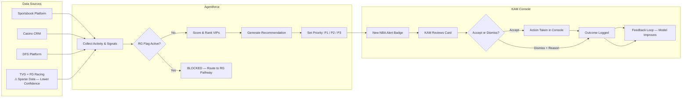
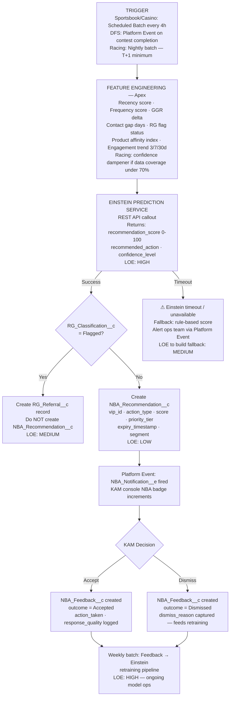
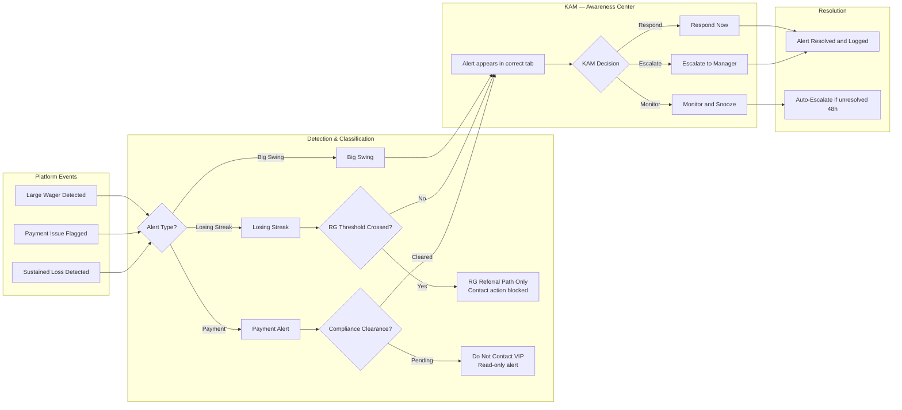
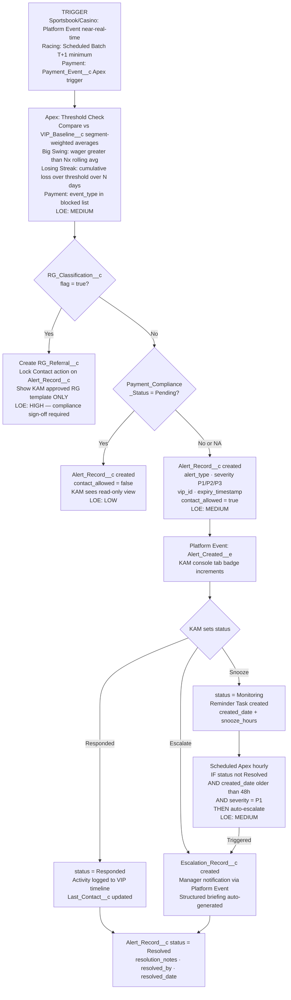
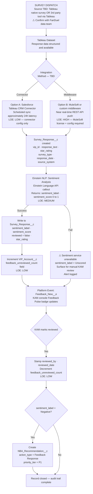
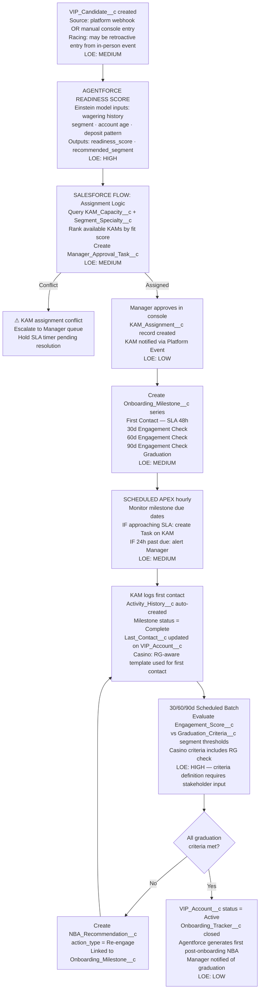
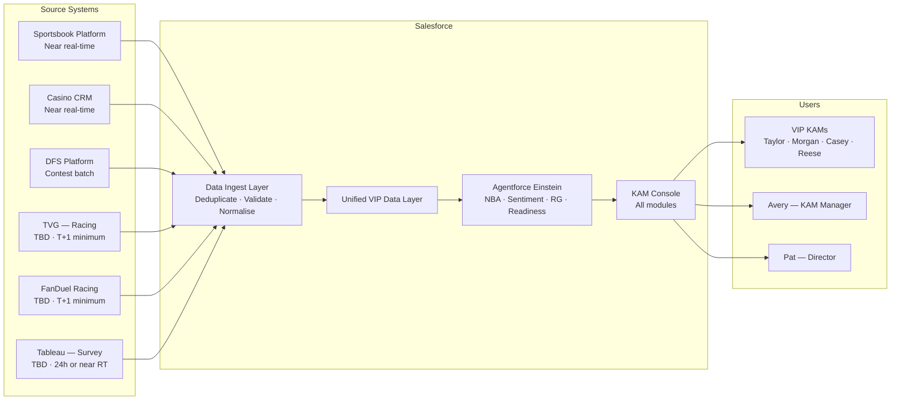
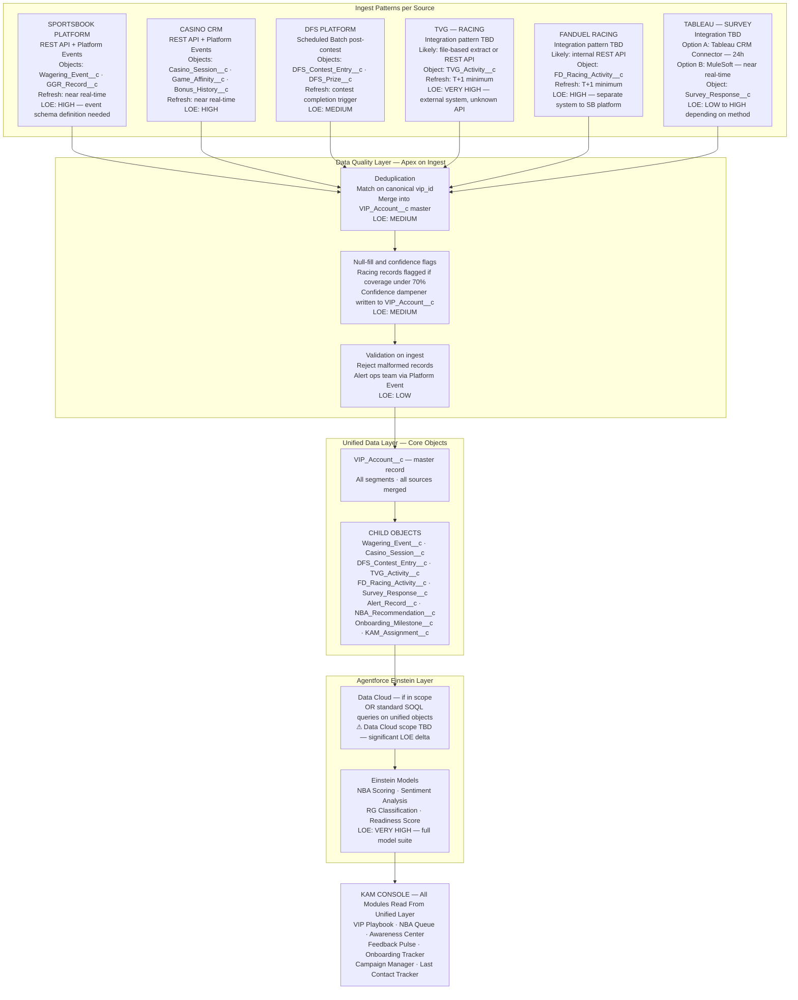

```mermaid
flowchart LR
  subgraph SURVEY["Survey"]
    SEND["Survey sent to VIP"]
    VIP_R["VIP responds"]
    TAB["Response lands in Tableau"]
  end
  subgraph INT["Integration — Method TBD"]
    OPT{"Which method?"}
    DIRECT["Option A: Tableau Connector\n24h latency · Lower LOE"]
    MIDDLE["Option B: MuleSoft Middleware\nNear real-time · Higher LOE"]
    SF["Salesforce — Survey_Response__c"]
  end
  subgraph PROC["Processing"]
    SENT["Einstein Sentiment\nPositive / Neutral / Negative"]
    STARS["Star Rating Captured"]
    VIP_UPD["VIP Record Updated\nUnreviewed count +1"]
  end
  subgraph KAM3["KAM Console"]
    BADGE["Feedback Pulse Badge Updates"]
    OPEN["KAM Opens Card"]
    DEC3{"Action?"}
    REV["Mark Reviewed"]
    RESP["Respond to VIP"]
    NEG{"Negative Sentiment?"}
    NBA_Q["Surface in NBA Queue as P1"]
    DONE["Logged and Closed"]
  end

  SEND --> VIP_R --> TAB --> OPT
  OPT -->|Connector| DIRECT --> SF
  OPT -->|Middleware| MIDDLE --> SF
  SF --> SENT & STARS --> VIP_UPD --> BADGE
  BADGE --> OPEN --> DEC3
  DEC3 -->|Review| REV --> NEG
  DEC3 -->|Respond| RESP --> NEG
  NEG -->|Yes| NBA_Q --> DONE
  NEG -->|No| DONE
```

```mermaid
flowchart LR
  subgraph ID["Identification"]
    THRESH2["Platform threshold alert"]
    MAN["Manual nomination"]
    CAND["Candidate Queue"]
  end
  subgraph ASSIGN["Assignment"]
    SCORE2["Agentforce Readiness Score"]
    KAPFIT["KAM capacity + segment match"]
    MGR["Manager approves"]
    NOTIFY2["KAM notified"]
  end
  subgraph FC["First Contact"]
    SLA["48h SLA timer starts"]
    TASK["Task auto-created with talking points"]
    CONTACT["KAM makes first contact"]
    MILE["Milestone logged"]
  end
  subgraph MON["Monitoring — 30/60/90 days"]
    D30["30d engagement check"]
    D60["60d engagement check"]
    D90["90d engagement check"]
    CRIT{"Meeting graduation criteria?"}
    REENGAGE["Re-engage NBA created"]
    GRADAPP["Manager graduation approval"]
    GRAD["Graduate to Active Playbook"]
  end
  subgraph MGRL["Manager Layer"]
    BREACH["SLA breach alert"]
    DIGEST["Weekly health digest"]
  end

  THRESH2 & MAN --> CAND --> SCORE2 --> KAPFIT --> MGR --> NOTIFY2
  NOTIFY2 --> SLA --> TASK --> CONTACT --> MILE
  MILE --> D30 --> D60 --> D90 --> CRIT
  CRIT -->|No| REENGAGE --> CONTACT
  CRIT -->|Yes| GRADAPP --> GRAD
  SLA -.->|Breached| BREACH --> DIGEST
```

# FanDuel VIP KAM Console — Lucidchart Import Guide
## For Technical Architect — System Process Flows

Each section below contains Mermaid syntax. In Lucidchart:
1. Create a new document
2. Click **Insert → Import → Mermaid** (or use the Mermaid shape library)
3. Paste the code block for each flow
4. Lucidchart converts it to an editable diagram
5. Repeat for each flow — one diagram per page recommended

Color key after import:
- 🟡 Amber nodes = RG decision gates or compliance checks
- 🟠 Orange/light nodes = open scoping questions (⚠ TBD)
- 🔴 Red nodes = blocked paths / error states
- 🔵 Blue = standard flow steps

---

## Flow 1: NBA Recommendation Engine
*How Agentforce generates, scores, and delivers a Next Best Action to the KAM.*

### Stakeholder View

### Technical View

### LOE Summary — Flow 1
| Component | Complexity | Notes |
|-----------|-----------|-------|
| Data ingest from SB/Casino | MEDIUM | Platform Events to be confirmed with FanDuel platform team |
| Data ingest from Racing (TVG + FD Racing) | HIGH | ⚠ Integration pattern TBD — two separate systems |
| Feature engineering (Apex) | MEDIUM | Segment-specific weighting logic needed |
| Einstein Prediction Service | HIGH | Model training data, scoring cadence, retraining loop |
| NBA_Recommendation__c object + logic | MEDIUM | Custom object + Flow automation |
| KAM feedback capture + retraining loop | HIGH | Ongoing model ops commitment |

---

## Flow 2: Awareness Center Alert Flow
*How Big Swings, Payment Alerts, and Losing Streak signals are detected, RG-gated, and surfaced to the KAM.*

### Stakeholder View

### Technical View

### LOE Summary — Flow 2
| Component | Complexity | Notes |
|-----------|-----------|-------|
| Platform Event integration SB/Casino | MEDIUM | Confirm event schema with platform team |
| VIP_Baseline__c — baseline calculation | HIGH | Segment-weighted, rolling window logic |
| RG_Classification__c + gating logic | VERY HIGH | ⚠ Compliance team must own threshold rules |
| Alert_Record__c object + UI | MEDIUM | Custom object + Awareness Center UI |
| Auto-escalation Scheduled Apex | MEDIUM | Straightforward batch logic |

---

## Flow 3: VIP Feedback Pulse — Survey Data Flow
*How survey responses travel from Tableau into the Feedback Pulse card, with sentiment scoring.*

### Stakeholder View

### Technical View

### LOE Summary — Flow 3
| Component | Complexity | Notes |
|-----------|-----------|-------|
| Tableau integration — Option A (Connector) | LOW | Simplest path, 24h latency acceptable? |
| Tableau integration — Option B (MuleSoft) | HIGH | ⚠ Requires MuleSoft license — confirm with arch |
| Survey_Response__c custom object | LOW | Simple custom object |
| Einstein Sentiment scoring | MEDIUM | Standard Einstein Language API |
| Feedback Pulse UI + badge logic | MEDIUM | Already prototyped in console |

---

## Flow 4: VIP Onboarding Automation
*From candidate identification through first contact to active book graduation.*

### Stakeholder View

### Technical View

### LOE Summary — Flow 4
| Component | Complexity | Notes |
|-----------|-----------|-------|
| VIP_Candidate__c + nomination flow | LOW | Simple object + screen flow |
| Readiness Score Einstein model | HIGH | Training data, model build, ongoing tuning |
| KAM assignment logic (Flow) | MEDIUM | Capacity + specialty matching |
| Onboarding_Milestone__c + SLA tracking | MEDIUM | Scheduled Apex + task automation |
| Graduation criteria definition | HIGH | ⚠ Requires business input per segment |

---

## Flow 5: Data Integration Architecture
*How all external systems feed into Salesforce to power the console.*

### Stakeholder View

### Technical View

### LOE Summary — Flow 5
| Component | Complexity | Notes |
|-----------|-----------|-------|
| Sportsbook Platform integration | HIGH | Platform event schema + API design with FD platform team |
| Casino CRM integration | HIGH | Session and game affinity data model |
| DFS Platform integration | MEDIUM | Batch — simpler pattern |
| TVG integration | VERY HIGH | ⚠ External system — unknown API, likely file extract |
| FanDuel Racing integration | HIGH | ⚠ Separate system from Sportsbook — confirm team ownership |
| Tableau integration | LOW–HIGH | ⚠ Depends on method chosen (Connector vs MuleSoft) |
| Data dedup + quality layer | MEDIUM | Canonical ID strategy needed upfront |
| Data Cloud (if in scope) | VERY HIGH | Significant additional LOE — evaluate against SOQL approach |
| Full Einstein model suite | VERY HIGH | Multi-model build + training data + ops |

---

## Open Scoping Questions — For Stakeholder Session

| # | Question | Owner | Impact |
|---|----------|-------|--------|
| 1 | TVG integration pattern — REST API or file extract? | Tech Arch + TVG team | Flow 1, 4, 5 LOE |
| 2 | FanDuel Racing — which team owns the API? | FD Platform team | Flow 1, 4, 5 LOE |
| 3 | Tableau → Salesforce — Connector or MuleSoft? | Data team + Arch | Flow 3, 5 LOE |
| 4 | Data Cloud in scope or standard SOQL? | Solution Architect | Flow 5 — very high LOE delta |
| 5 | Who owns RG classification thresholds — Compliance or Product? | Compliance + Product | Flow 2 — gating logic |
| 6 | Graduation criteria per segment — who defines? | VIP Business team | Flow 4 — cannot build without this |
| 7 | Survey format confirmed? Star ratings staying or removed? | FanDuel VIP team | Flow 3 — data model |
