# FanDuel VIP KAM Console — User Flows

KAM-facing task flows through **this prototype** (`index.html`).  
Not journey maps (emotion / pain — see `user-journey-maps.md`).  
Not system architecture (objects / LOE — see `system-process-flows.md`).

**Personas:** Taylor (Sportsbook) · Morgan (Casino) · Casey (DFS) · Reese (Racing) · Avery (Manager)  
**Source:** External insights readout + two insight PDFs. Core line: *the ACE homepage is a dead end.*

Each flow names the **console module** the KAM actually clicks. Gaps are called out in place — do not read a toast (`showToast`) as a finished workflow.

---

## How these map to insights

| Insight (readout) | User flow | Console surface |
|---|---|---|
| Homepage drives no action · ~2 hrs HVP Excel | **UF1 Morning command** | VIP Playbook · Next Best Action · Agentforce |
| Bonusing runs on Excel, not ACE | **UF2 Issue a bonus** | Playbook My VIPs · Campaign Manager · NBA Send Bonus |
| Big wins/losses invisible until too late | **UF3 Win/loss outreach** | Notifications · Real-Time Awareness · NBA |
| Events in 4 tools, synced in none | **UF4 Event invite** | Upcoming Events · Campaign Manager |
| Lifecycle in spreadsheets | **UF5 Onboard** · **UF6 Demote / bench** | Onboarding & Offboarding |
| AI already in the room (Claude) | Agentforce companion on UF1–UF4 | Agentforce panel |
| WPC / cadence (SBK today) | **UF7 Last contact + WPC** | Last Contact Tracker · Tasks & WPC |
| Feedback corpus unused as a queue | **UF8 Feedback response** | VIP Feedback Pulse · NBA New Feedback |
| Losing streak / RG (Casino especially) | **UF9 Welfare check** | Awareness Losing Streaks · NBA Churn Risk |
| Manager gap (6/6 DIY) | **UF10 Team exceptions** | **Not in prototype** |

---

## UF1 — Morning command

**Persona:** Taylor (primary) · Morgan (same path, tighter clock)  
**Insight:** Every KAM bounced off ACE in seconds. Morning work is Slack HVP Excel (~2 hrs) because ACE refreshes ~11am–2pm.  
**Job:** *Who needs me now, why, and what is safe?*

**Happy path (prototype)**

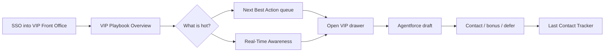

| Step | KAM does | Console |
|---|---|---|
| 1 | Land | Hero “Hello, Jordan” · **VIP Playbook** Overview KPIs |
| 2 | Scan book | Playbook tabs: Overview / My VIPs · segment chips SBK · Casino · DFS · Racing |
| 3 | Read the queue | **Next Best Action** (4 Actions) — Birthday, Churn Risk, New Feedback |
| 4 | Check overnight money | **Real-Time Awareness → Big Swings** |
| 5 | Open one human | VIP name → drawer / `openVipModal` |
| 6 | Prepare, don’t send blind | **Agentforce** companion drafts; KAM edits |
| 7 | Close the loop | Action on NBA card → **Last Contact Tracker** updates |

**Morgan delta:** If Playbook timestamps are still “since last HVP,” she will bounce. Awareness must be intra-shift.  
**Casey / Reese:** Overview KPIs are SBK-shaped. See UF1 notes in Playbook journey — do not fake handle for DFS/Racing.

**Replaces today:** Slack Excel + Admin Web + Tableau tabs before first outreach.

---

## UF2 — Issue a bonus (or voucher)

**Persona:** Taylor · Morgan (CPP) · Casey (voucher — **gap**)  
**Insight:** “I get the HVP report, open Excel, copy into ACE, bonus manually. It takes two hours.” Bulk Bonus exists on SBK (Claude CSV); Casino has none; DFS is AdminWeb CSV; Racing has no ACE path.

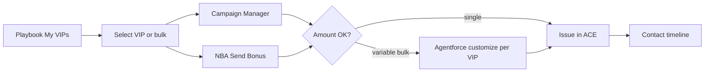

| Step | KAM does | Console |
|---|---|---|
| 1 | Find who | **My VIPs** search / segment filter / bulk bar |
| 2 | Choose rail | **Campaign Manager** *or* NBA **Send Bonus** |
| 3 | Set amount | Modal — Agentforce can vary amounts (readout: “customize then send together”) |
| 4 | Safety | Restricted / RG / “don’t bonus” must block or confirm — not silently drop (DFS outage: 75 of 200 manual) |
| 5 | Confirm | User notification (ACE bonus has this; AdminWeb vouchers do not) |

**Morgan:** CPP/KNIME is still outside ACE in real life. Prototype must show token status on the drawer or she keeps a second memory.  
**Casey:** Campaign Manager is bonus-shaped. Contest voucher is a **variant of this flow**, not UF1.

**System pair:** data freshness in `system-process-flows.md` Flow 5. If HVP is still 2pm, this flow dies at step 1.

---

## UF3 — Big win / big loss → outreach

**Persona:** Taylor · Morgan (24/7 bar)  
**Insight:** Highest-value outreach moment. No ACE trigger. Casino: midnight win, next-business-day data. Prototype already has Ethan Parker −$12,400 on the bell **and** on NBA Churn Risk.

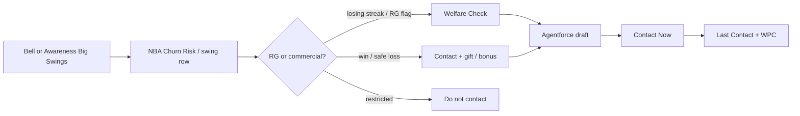

| Step | KAM does | Console |
|---|---|---|
| 1 | Notice | **Notifications** “Critical: Ethan Parker large loss” *or* **Awareness → Big Swings** |
| 2 | Context | NBA expand: GGR, last contact, RG bullet (“check required before any offer”) |
| 3 | Decide | **Contact Now** / **View Wagers** / **View Profile** — not one generic Reach Out |
| 4 | RG | Losing Streaks tab **Welfare Check** (Ethan, 7 sessions, −$31,200) uses approved language |
| 5 | Log | WPC row for Ethan stays Pending until Contact completes |

**Morgan:** This flow *is* the Casino morning if data is live.  
**Reese:** Alert on a duplicate TVG+FDR row is worse than no alert.

**System pair:** Flow 2 Awareness Center in `system-process-flows.md`. UX layer on AWS Intelligence Engine.

---

## UF4 — Event invite → (attendance still open)

**Persona:** Taylor · Morgan · Casey (trips) · Reese (venues)  
**Insight:** Asana request → Splash RSVP → Ticket Manager seats → Excel ROI. TM↔ACE is the one integrated step. “Two KAMs both gave out the same ticket.”

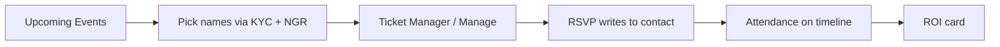

| Step | KAM does | Console **today** |
|---|---|---|
| 1 | See inventory | **Upcoming Events** → Manage |
| 2 | Choose VIPs | Playbook / KYC — Agentforce rank is the ask, not built |
| 3 | Issue seats | Ticket Manager path (liked in research) |
| 4 | RSVP / attend | **Gap** — Splash and notes. Prototype does not write “attended Mets 8-16” |
| 5 | Follow up | Untracked personal reminders |

Prototype covers **step 1 and 3**. Steps 2, 4, 5 are why Events is still a P1 build, not “done because there is a card.”

**Casey:** Blowout trip + travel credit, not a seat.  
**Reese:** Keeneland email must still hit step 4.

---

## UF5 — Onboard a new VIP

**Persona:** Taylor / Morgan (Sep 1 auto-onboard SBK+Casino) · Reese (assigns opportunities) · Casey (query-driven, no cap)  
**Insight:** Rookie lists live in personal spreadsheets. “If I left tomorrow, that knowledge is gone.”

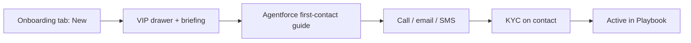

| Step | Console |
|---|---|
| Queue | **Onboarding & Offboarding → New** |
| First impression | Agentforce talking points — not a generic template |
| Proof | **Last Contact Tracker** shows first contact without extra typing |
| Graduate | VIP appears in **My VIPs** with cadence |

**Casey:** Identification is a Databricks query, then ACE. Console “New” tab is empty unless that query writes in.  
**Reese:** Opportunity assignment is this flow’s Racing shape.

**System pair:** Flow 4 VIP Onboarding Automation.

---

## UF6 — Demote or seasonal bench

**Persona:** Taylor / Morgan · Avery reviews · Casey rarely (no cap)  
**Insight:** No flag in ACE; re-onboarding not blocked; demotion blacklists in manager notes. RG timeout must not look like churn.

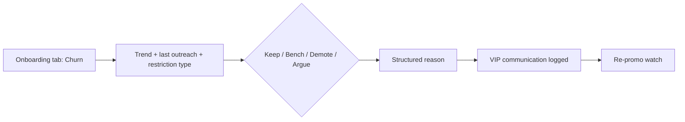

Prototype has New / Churn rows (e.g. Sophia, Parker). Missing: **seasonal bench** as a state, **reason dropdown**, manager SLA so recs don’t rot.

---

## UF7 — Cadence: last contact + WPC

**Persona:** Taylor (WPC exists) · Morgan (waiting)  
**Insight:** Bulk email fakes last activity. WPC: three statuses, no email-from-case, forced via Tableau scorecard.

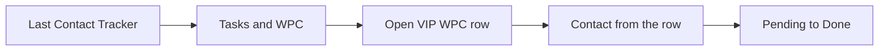

| Console | Use |
|---|---|
| **Last Contact Tracker** | Bottom of book first; personal vs bulk (data definition still required) |
| **Tasks & WPC** | Filters: All / Tasks / WPC · Pending / Done |
| Contact | `openWpcContact` on Ethan, Sophia, Isla, Logan |

Do **not** roll WPC to Casino / Racing / DFS until statuses and in-row outreach exist.

---

## UF8 — Feedback that needs a human

**Persona:** Taylor / Morgan (95% of the 18k corpus)  
**Insight:** Feedback is captured; it is not a homepage queue. Pulse in the prototype is the right object.

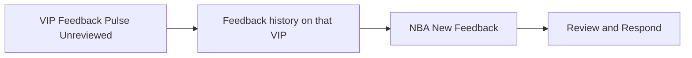

Competitor-named records belong as a **flag** here (and on NBA), not a seventh module.

---

## UF9 — Welfare / losing streak (RG gate)

**Persona:** Morgan especially · Taylor  
**Insight:** Commercial vs duty of care. Prototype already splits **Draft Outreach** vs **Welfare Check**.

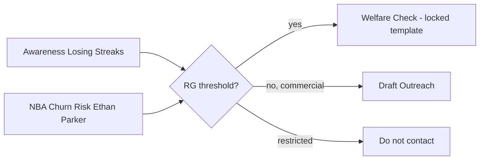

If Agentforce ever offers a bonus on this card before welfare, the flow is wrong. NBA copy for Ethan already says that — keep it as a hard gate.

---

## UF10 — Manager exceptions (Avery)

**Persona:** Avery (hybrid default)  
**Insight:** All 6 managers built a DIY. “Click, click, click.” Prototype is **KAM-only**.

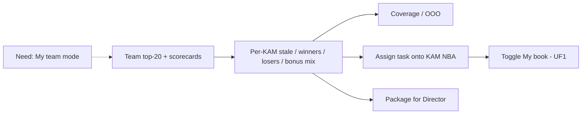

Dotted = **not in `index.html`**. Do not demo Jordan’s Playbook as the manager product.

---

## Segment overlays (not extra flows)

| Persona | What changes |
|---|---|
| **Taylor** | UF1–UF8 are the contract. Event-driven clock. WPC exists. |
| **Morgan** | UF3 and UF9 SLAs are hours, not next-HVP. UF2 includes CPP. Host team covers UF1 when she is off. |
| **Casey** | UF2 becomes nightly **voucher**; UF4 becomes blowout trip; UF6 almost never. Playbook columns = entry / RAKE / contest, not handle. |
| **Reese** | UF1 blocked on TVG+FDR identity. UF4 is venue/manual. Agentforce must beat the Claude dedupe script. |
| **Avery** | UF10 is the job. Hybrid = UF10 + UF1 via toggle. |

---

## Prototype coverage

| Flow | In `index.html` | Honest gap |
|---|---|---|
| UF1 Morning | Playbook + NBA + Awareness + Agentforce | Data is mocked; freshness SLA unproven |
| UF2 Bonus | Campaign Manager + NBA Send Bonus | No variable bulk; no CPP; no DFS voucher |
| UF3 Win/loss | Bell + Swings + NBA Churn | Not wired to AWS IE |
| UF4 Events | Upcoming Events list | Attendance / RSVP / ROI / lock |
| UF5 Onboard | New tab | First-contact playbook, KYC ingest |
| UF6 Demote | Churn tab | Bench + structured reason |
| UF7 WPC | Last Contact + WPC | Personal vs bulk; email-from-row |
| UF8 Feedback | Pulse + NBA Feedback | Capture parity DFS/Racing |
| UF9 RG | Losing Streaks + welfare button | Locked templates not implemented |
| UF10 Manager | **Missing** | Entire flow |

---

---

## UF11 — No Contact Alert → outreach action

**Persona:** Taylor (primary) · all KAMs  
**Insight:** KAMs lose track of lower-tier VIPs between WPC cycles. This card surfaces them before they become a spreadsheet problem.

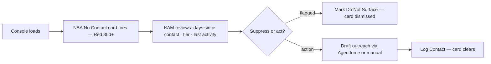

- **Orange/Yellow cards (15–28d):** KAM may defer; Red cards surface to top of queue and cannot be silently dismissed without a reason
- **Tier threshold mismatch:** If VIP tier data is missing card uses 15d default and shows a data warning
- **Gap:** Text (SMS) tracking via SnippetSentry not available until Q4 — card treats email + logged calls only until then

---

## UF12 — CS/HVP Interaction Alert → KAM follow-up

**Persona:** Taylor · Morgan  
**Insight:** KAMs currently have no visibility when a VIP calls CS. By the time the KAM hears about it the relationship damage is done.

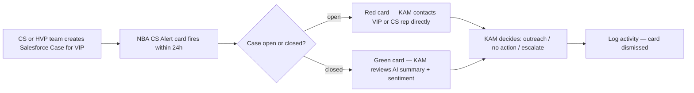

- **Key process dependency:** Card only fires if CS and HVP teams create Cases in Salesforce for every VIP interaction — confirm this with FanDuel ops before committing as MVP
- **Multiple cases in 24h:** Second case on same VIP escalates card priority and notifies KAM Manager
- **Gap:** AI sentiment summary is Phase 3 (Agentforce) — MVP card shows case details only

---

## UF13 — Big Loss Alert → empathy outreach

**Persona:** Morgan (Casino primary) · Taylor  
**Insight:** Big losses are invisible to KAMs until the WPC report or the VIP self-reports. Empathetic outreach in the 24h window is the retention lever.

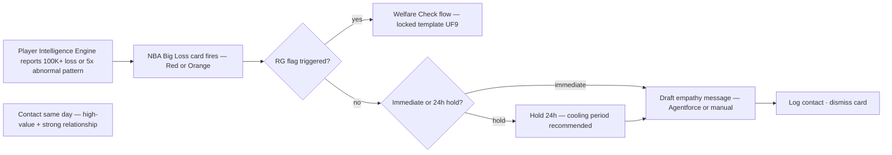

- **Data dependency:** Both categories require Player Intelligence Engine / AWS Agent data in Salesforce — this is the Phase 3 FD data requirement; card is mocked in prototype
- **RG gate:** If loss pattern triggers RG threshold welfare check flow takes priority over retention outreach (same gate as UF9)
- **Gap:** Bet ID linkage for $100K+ category requires FanDuel to expose wager-level data in Salesforce

---

## UF14 — Show Some Love → bonus issuance

**Persona:** Taylor · Morgan · Casey  
**Insight:** KAMs manually track bonus cadence in spreadsheets. When RTC slips the delay between recognizing the gap and issuing a bonus is days, not hours.

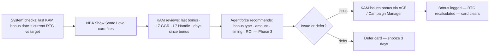

- **MVP scope:** Card trigger (15d + RTC < target) is Phase 1 config; AI recommendation is Phase 3 Agentforce layer
- **ACE dependency:** RTC field and KAM-issued bonus history must be available in Salesforce — confirm field mapping with ACE integration team
- **Distinction matters:** Card must only fire on KAM-issued generosity bonuses — system-generated promotions should not satisfy the 15d threshold

---

## Review

Use UF1, UF3, and UF9 as the **walkthrough script** against the local console (password flow → Jordan homepage → bell → Ethan NBA → Losing Streaks). UF2 and UF4 show what the cards imply vs what research still needs. UF10 is the slide that says the prototype is a KAM command center, not the console.

UF11–UF14 map to the 4 NBA scenarios prioritized for the prototype mock. UF11 (No Contact) and UF14 (Show Some Love) are the most OOTB Salesforce — use these to anchor the NBA demo. UF12 depends on CS case process confirmation; UF13 depends on FD data feed.
